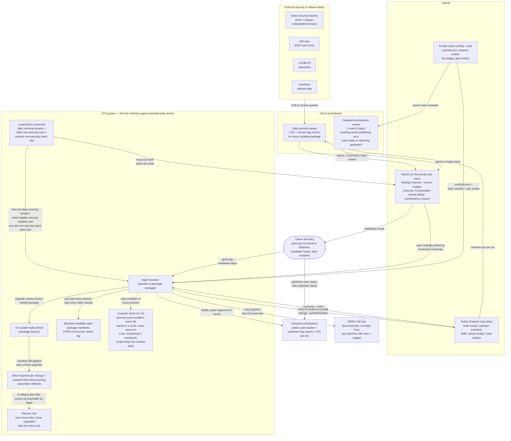

<p align="center">
  
</p>

A [Linux From Scratch](https://www.linuxfromscratch.org/) (LFS 13.0,
systemd) system built **and operated** by an AI agent.

> ⚠️ **Experimental research project — use with care.**

Linux From Scratch normally means compiling a whole Linux system from
source by hand, following the LFS book. This project goes two steps
further.

1. **Everything is scripted.** Every package is a reproducible build
   script, every installed file is tracked in a manifest, every source
   is checked against a pinned hash before it touches the build.
2. **An agent runs the system.** Builds, upgrades, security
   monitoring, and boot testing, under written contracts (CLAUDE.md,
   OPERATIONS.md, AGENT-DESIGN.md). The human decides go/no-go on
   kernel and toolchain changes and provides physical hands. That's
   it.

It boots a real laptop (GPU acceleration, Wi-Fi, Bluetooth) and is
used as a daily driver, with the agent running *on* the LFS system
itself.

**Why not just use a package manager?** A package manager hands you
the same bytes every time, but nobody reads the install logic those
bytes came from. Here every install is a reviewed, pinned script, and
that scrutiny pays outward. Two of the security reports on
[the public reports page](https://felixbrock.github.io/upstream-reports/)
came from reading one vendor installer before its first run (a
hash-verification tier that silently disabled itself, a nested
unpinned curl-to-bash). The packaged path caught neither. We checked,
no official distro package exists for that app and the community
packages sidestep the vendor's protections instead of carrying them.
Deterministic delivery is not review. Someone still has to read the
install path.

> **Two audiences read this file.** A **human** deciding whether to
> run this reads [For the human](#for-the-human) and stops. An
> **agent** operating the system, or anyone wanting the full
> picture, starts at [For the agent](#for-the-agent).

## For the human

You don't build or run this yourself. You **supervise an agent that
does**, and stay available for the few decisions and physical steps
only you can make.

### Quickstart

1. **Get a coding agent on its strongest model.** Built and operated
   with Claude Code on Claude's frontier tier (currently Fable 5). A
   source build runs for days, weaker models drift over that
   distance. Other agents work too (see [Operating](#operating)).
2. **Create two private repos of your own**, a *config* repo (device
   paths, secrets policy) and an *ops* repo (operational history).
   Nothing machine-specific ever goes in this public blueprint, and
   the agent walks you through the setup. Why the separation matters
   is [case study 005](case-studies/005-operating-in-public-without-leaking.md).
3. **Point the agent at this repo and say what you want.** "Build
   this system", or on a built one, ask where things stand. The
   contracts and skills carry the procedure.
4. **Stay in the loop.** You get exactly two kinds of handoff,
   go/no-go on kernel and toolchain changes, and actions that need
   root or physical hands.

### Requirements

Front-loaded, because this runs *alongside* your real system for
weeks before it can replace anything.

- a host Linux install you keep, it stays build host and safety net
  until the new system is proven (never your only machine)
- separate target media, a spare disk, SD card, or partition
- hardware headroom, multi-core CPU and tens of GB of disk
- a frontier-model coding agent and an account that survives a long,
  mostly-autonomous build
- your time and judgment for go/no-go moments and hands-on steps

### Architecture

The whole operating model on one screen. You make go/no-go calls and
provide hardware hands, the agent does everything else against this
repo as the single source of truth, watched by scheduled security
checks, with automatic rollback behind every change.



The agent-facing detail behind each box is in
[How it works](#how-it-works).

### Upstream reports

Impact beyond this machine. Defects this project hits in real
software get root-caused, dupe-checked against the upstream tracker,
and reported under the owner's identity (an already-filed finding
gets a verified confirmation on the existing thread instead of a
duplicate). Ground truth lives in the private ops repo and every
change republishes the public table at

**https://felixbrock.github.io/upstream-reports/**

## For the agent

Everything below is the operational picture, written for the operator
(an agent, or a deeply technical reader). Read the human section
first, its [Architecture](#architecture) diagram is written for you
too.

### Operating

```sh
git clone https://github.com/felixbrock/agent-lfs.git ~/repos/agent-lfs
cd ~/repos/agent-lfs
claude    # any coding agent works, the operator contract is CLAUDE.md / AGENTS.md
```

Telling the agent "build this system", or `/lfs-status` on a built
one, is enough. The contract, the vendored book pages, the scripts,
and the skills (`.claude/skills/`, `/lfs-status` `/lfs-upgrade`
`/lfs-sweep`) carry the procedure, the hash ledger and file manifests
keep it honest. Use a flagship model, and expect to stay in the loop
for root commands and go/no-go calls.

Not a Claude Code user? The contract is mirrored at
[AGENTS.md](AGENTS.md), the convention read by
[Codex CLI](https://github.com/openai/codex),
[Hermes Agent](https://github.com/NousResearch/hermes-agent), and
most other coding agents. Skills are plain markdown, point your agent
at `.claude/skills/*/SKILL.md`. The same model rule holds.

Everything machine-specific comes from the private sibling repos, see
[Three-repo split](#three-repo-split). The blueprint never needs
editing for instance values.

### Reading order

- [OPERATIONS.md](OPERATIONS.md) — the operating model
- [CLAUDE.md](CLAUDE.md) — the operator contract
- [AGENT-DESIGN.md](AGENT-DESIGN.md) — register of every deviation from the book
- [PROVENANCE.md](PROVENANCE.md) — supply-chain rules
- [INVARIANTS.md](INVARIANTS.md) — standing invariants, checked after every session
- [case-studies/](case-studies/) — real diagnosis chains, the best sense of what this is like

### How it works

The repo is the spec. Every package is a build script, every book
deviation is registered, and the running system never diverges from
what is committed here. The agent's roles,

- **package manager** — build the new version, diff manifests, apply
  onto a fresh snapshot, boot-test, promote
- **security monitor** — scheduled cloud sweep of CVE trackers and
  release feeds for every installed component (~290 tracked)
- **incident responder** — open findings picked up at every session
  start and driven to a committed fix
- **contributor** — a periodic review flags work worth publishing as
  a [case study](#case-studies) or reporting upstream; the agent
  drafts, the human approves what goes out

The mechanics behind the diagram,

- **every fix lands as a script change first** and is applied second,
  never the reverse, so nothing exists on the machine the repo can't
  explain
- **packages build in the host chroot or natively on the live
  system** (same hash gate, stamps, manifests), and a QEMU VM twin
  boot-tests boot-critical changes before they touch metal
- **monitoring matches the software class**, source packages against
  the Arch *and* Debian trackers, vendor binaries by version lag,
  user-level Python via OSV.dev, LFS/BLFS advisories as remediation
  recipes; findings arrive as GitHub issues, and a broken sweep
  raises its own issue, so a quiet day means a clean day
- **coverage is a closed loop**, `scripts/coverage-check.sh` compares
  everything installed against everything monitored and flags the
  difference until it's mapped or ignored with a written reason (its
  first run caught an unmonitored Chrome install)
- **every upgrade batch lands on a fresh btrfs snapshot**,
  systemd-boot boot counting promotes or auto-rolls-back, and a
  rescue root (own boot entry, never co-upgraded) comes up over SSH
  if even the fallback fails
- **the machine remembers**, a STATE.md journal, per-package
  manifests, and a kernel-enforced append-only action log
  (`chattr +a`), so any session reconstructs state without chat
  history

### Invariants

The guarantees above are an explicit register,
[INVARIANTS.md](INVARIANTS.md), checked as a whole. The shape is
borrowed from the seL4 verification project ([Klein et al., SOSP
2009](https://www.sigops.org/s/conferences/sosp/2009/papers/klein-sosp09.pdf)),
state the invariants explicitly and check every one
deterministically.

- **I1** — every binary and library appears in a package manifest
- **I2** — every manifest traces to a build script
- **I3** — every staged artifact is pinned in the hash ledger
- **I4** — everything runnable is monitored or ignored with a written
  reason
- **I5** — build scripts keep the failure-visible style
  (`set -euo pipefail`, one command per line)

`scripts/invariant-check.sh` runs all five read-only as the
post-condition of every session. An upgrade isn't done when the
package builds, it's done when the invariants hold again.
Pre-existing gaps are baselined in the private ops repo, never
silently ignored. The first full run surfaced an unmonitored
toolchain and two style violations, exactly the small
testing-resistant faults the seL4 bug data warns about.

### Building by hand

The same path the agent takes, the book as scripts. Expect days of
compile time and a human for root steps.

1. Host prerequisites per LFS 13.0 ch. 2–3 (book pages vendored under
   `book/`), then `sudo scripts/prep-ch4.sh`.
2. Stage sources into `/mnt/lfs/sources`, every artifact must pass
   `scripts/verify-source.sh` against the pinned ledger
   (`ops/sources-sha256.txt`).
3. Run the chapters in order, `build/ch5` and `build/ch6` as the
   `lfs` user, `sudo scripts/prep-ch7.sh` (read its security note)
   for the `build/ch7`–`ch8` chroot, then chapter 9 and the BLFS
   tiers (`build/blfs/`). Every script is stamped and writes a
   manifest, so reruns are surgical.
4. Boot-test in QEMU, `scripts/vm-up.sh` (`--display` for a window),
   `scripts/vm-down.sh` to shut down safely.

### Three-repo split

- **agent-lfs** (this repo, the blueprint) — scripts, contracts,
  skills, sweep machinery, case studies. Tied to no machine or
  person.
- **lfs-ops** (private, the operations log) — the concrete machine's
  lineage, incidents, current package state. A complete, current,
  attributed ops log of a personal machine is a targeting dossier,
  so episodes only graduate to public case studies once cold and
  sanitized.
- **lfs-config** (private, the instance) — what a session must read
  to operate this machine, `machine.env`, dotfiles, verification
  state, credentials policy.

All three are siblings. Blueprint machinery resolves the config repo
via `$LFS_CONFIG` and sources `machine.env`, which points at the ops
repo (`LFS_OPS`) and live ledger (`LFS_LEDGER`). To run your own
system, create your own private pair, the blueprint never needs
editing and your operational history never needs publishing.

### Provenance

Every artifact passes `scripts/verify-source.sh` before it may be
staged or built. Known artifacts must byte-match the sha256 ledger
(the blueprint ships an empty one, a running instance keeps its live
ledger private). New artifacts need an independently published hash
and are pinned permanently. A mismatch is a supply-chain event, not
an inconvenience. Sources come only from canonical upstream hosts,
binaries only from vendor-official endpoints (full table in
PROVENANCE.md). Reproducing from the ledger gives you the exact
bytes this system was built and boot-tested from.

### Case studies

Real failures diagnosed to root cause, dead ends left in. Published
after the fact, past-tense, delayed for anything security-relevant,
and passed through a mechanical leak gate (see
[case study 005](case-studies/005-operating-in-public-without-leaking.md)).

- [001 — The touchpad that insisted it was a mouse](case-studies/001-touchpad-enumeration.md),
  four kernel revisions, two Kconfig traps, the config-verify-gate pattern
- [002 — The GPU that was dark for days](case-studies/002-the-gpu-that-was-dark.md),
  a desktop software-rendered its whole life, the initramfs-firmware rule
- [003 — The invisible LUKS prompt](case-studies/003-the-invisible-luks-prompt.md),
  a boot-console gap latent for ten kernel revisions
- [004 — The build environment richer than the machine](case-studies/004-the-build-env-richer-than-the-machine.md),
  dependencies hiding in the chroot, why "prove the native pipeline" is a gate
- [005 — Operating a personal machine in public without leaking it](case-studies/005-operating-in-public-without-leaking.md),
  the accumulation threat model and the three-repo split

### Known upstream issues & workarounds

Issues already known upstream, fixed in newer book revisions, or not
reportable by policy, kept here with workarounds. Genuinely new
defects go to [Upstream reports](#upstream-reports).

- **yajl 2.1.0** — CMake 4 breakage, worked around in
  `build/blfs/scripts/130-yajl.sh`. Upstream
  [#257](https://github.com/lloyd/yajl/issues/257) /
  [PR #256](https://github.com/lloyd/yajl/pull/256) unmerged, project
  dormant since 2015.
- **unzip60** — unbuildable under GCC 15's C23 default, libarchive
  replacement in `build/blfs/scripts-gatec/203-unzip.sh`. BLFS has
  since adopted the same path.
- **XML-Parser 2.54** — runtime deps missing from the LFS 13.0 book
  (`build/ch8/425-427*.sh`, `430-xml-parser.sh`). Since addressed in
  the development books.
- **GCC 15.2 pass 1 under a GCC 16 host** — libcody C++20 breakage,
  pass-1-only gnu++17 pin (`build/ch5/20-gcc-pass1.sh`). Not
  book-reportable, hosts newer than tested are unsupported.

## License

Original work here (scripts, contracts, skills, documentation) is
MIT-licensed, see [LICENSE](LICENSE). The vendored pages under
`build/` and `book/` are unmodified excerpts from the
[LFS](https://www.linuxfromscratch.org/lfs/) and
[BLFS](https://www.linuxfromscratch.org/blfs/) books, copyright ©
Gerard Beekmans and the LFS/BLFS development teams, under the books'
own licenses (CC BY-NC-SA for the text, MIT for the computer
instructions).
